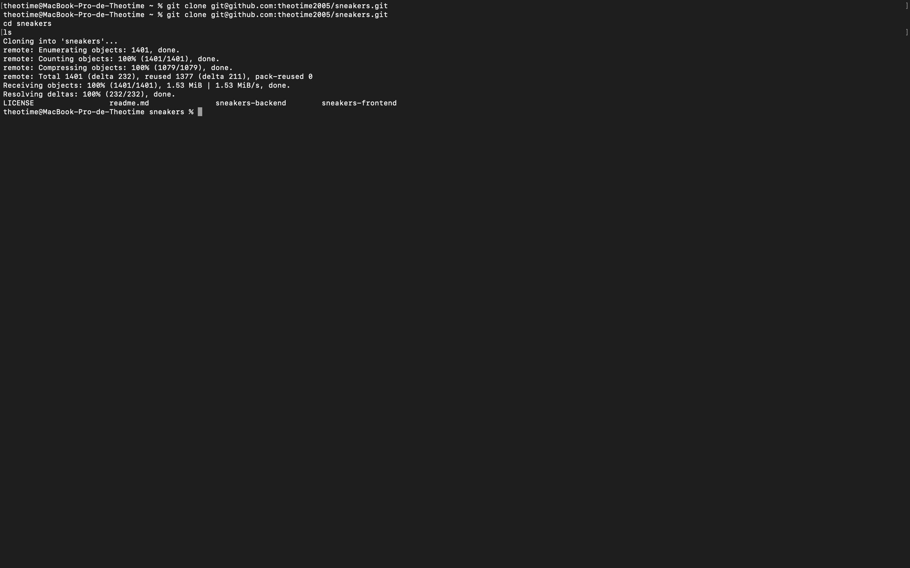

# Sneakers
This project has been realized during my first year to Epitech Digital School.

# Finality
To this product, I could delivering a backend with a database, and a frontend with the frameworks that I wanted.
The backend has been created with Express.js and sql, and the frontend in Vue.js.
Finally, I must have a website to manage sneakers, with personals collection and wish list.

# Get the resources
Past this lines on your terminal:
```bash
git clone git@github.com:theotime2005/sneakers.git
cd sneakers
ls
```

Normaly, you will be have this display:


# Installation
## The server
### First, load the database
You must to use a SGDB to manage your users, collections and wish lists. Two sql files are ready to help you. This sql files was created with MySQL.
1.  If you can using phpMyAdmin, use the import function to load the file:<sneakers-backend/sql/create_tables.sql> and <sneakers-backend/sql/insert_roles.sql> to load the differents tables and necessaries relations.
2. If you don't have it, report to the documentation of your SGDB to load file. You can copy and past the folowing code on your sql console:
```sql
DROP DATABASE IF EXISTS `sneakers`;
CREATE DATABASE `sneakers`;
USE `sneakers`;

-- Delete tables if exists
DROP TABLE IF EXISTS `Collections`;
DROP TABLE IF EXISTS `Roles`;
DROP TABLE IF EXISTS `Users`;
DROP TABLE IF EXISTS `WishList`;

-- Create "Roles" table
CREATE TABLE `Roles` (
    `id` INT NOT NULL AUTO_INCREMENT,
    `name` VARCHAR(15),
    PRIMARY KEY (`id`)
) ENGINE=InnoDB DEFAULT CHARSET=utf8;

-- Create "Users" table
CREATE TABLE `Users` (
    `id` INT NOT NULL AUTO_INCREMENT,
    `email` VARCHAR(50),
    `username` VARCHAR(30),
    `password` VARCHAR(1024),
    `role_id` INT,
    PRIMARY KEY (`id`),
    CONSTRAINT `fk_user_role`
        FOREIGN KEY (`role_id`)
        REFERENCES `Roles` (`id`)
) ENGINE=InnoDB DEFAULT CHARSET=utf8;

-- Create "Collections" table
CREATE TABLE `Collections` (
    `user_id` INT,
    `sneaker_id` INT,
    PRIMARY KEY (`sneaker_id`),
    CONSTRAINT `fk_user_collection`
        FOREIGN KEY (`user_id`)
        REFERENCES `Users` (`id`)
) ENGINE=InnoDB DEFAULT CHARSET=utf8;

-- Create "WishList" table
CREATE TABLE `WishList` (
    `user_id` INT,
    `sneaker_id` INT,
    PRIMARY KEY (`sneaker_id`),
    CONSTRAINT `fk_user_wishlist`
        FOREIGN KEY (`user_id`)
        REFERENCES `Users` (`id`)
) ENGINE=InnoDB DEFAULT CHARSET=utf8;

INSERT INTO Roles (name) VALUES ("standard");
INSERT INTO Roles (name) VALUES ("admin");
```

### Start your sql server
Start your sql server and check that you have:
-   The host,
- The port,
- The password,

### Prepare your backend server
in the sneakers-backend folder, create a file ".env",  past and complete the folowing code:
```plaintext
SQL_HOST=""
SQL_DATABASE="sneakers"
SQL_USER=""
SQL_PASSWO"
SQL_PORT=
TOKEN_CHARACTERS = ""
```
Warning, the port must be an int, and "TOKEN_CHARACTERS" represent the string to hash passwords. You can make a long string in this last variable.

### Start the express server
In your terminal, goto sneakers-backend, and run this code:
```bash
npm install
```

After the downloading, you can start the server with the folowing methods:
-  Developpement, to using nodemon and test the server
```bash
npm run dev
```

-  In normal mode, to using servor just with node
```bash
npm start
```

The port number of your server will be display.


## Front
### Dependencies installation
Run the folowing code to install the dependencies:
```bash
npm install
```


### Start options
To develop, you can use:
```bash
npm run dev
```


You can press 'o' and return to open the homepage.
To build the app, run:
```bash
npm run build
```
