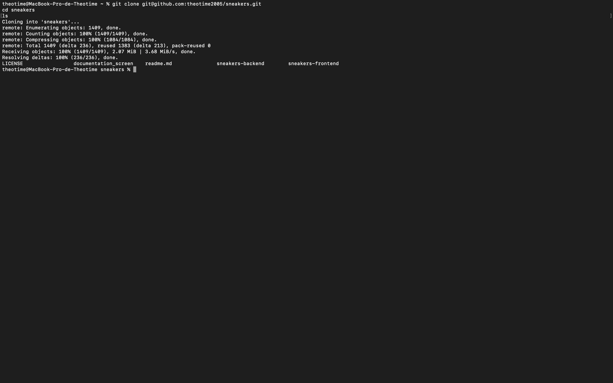

# Sneakers
This project was realized during my first year at Epitech Digital School.

## Finality
For this project, I delivered a backend with a database and a frontend using the frameworks that I wanted. The backend was created with Express.js and SQL, and the frontend with Vue.js. Ultimately, I aimed to create a website to manage sneakers, including a personal collection and wish list.

## Get the resources
Paste these lines into your terminal:
```bash
git clone git@github.com:theotime2005/sneakers.git
cd sneakers
ls
```
Normally, you should see the following display:


## Installation
### The server
#### First, load the database
You must use an SGDB to manage your users, collections, and wish lists. Two SQL files are ready to assist you. These SQL files were created with MySQL.
1.  If you can use phpMyAdmin, use the import function to load the files: [create_table](sneakers-backend/sql/create_tables.sql) and [Insert_roles](sneakers-backend/sql/insert_roles.sql) to load the different tables and necessary relations.
2.  If you don't have it, refer to the documentation of your SGDB to load the file. You can copy and paste the following code into your SQL console:
```sql
DROP DATABASE IF EXISTS `sneakers`;
CREATE DATABASE `sneakers`;
USE `sneakers`;

-- Delete tables if exists
DROP TABLE IF EXISTS `Collections`;
DROP TABLE IF EXISTS `Roles`;
DROP TABLE IF EXISTS `Users`;
DROP TABLE IF EXISTS `WishList`;

-- Create "Roles" table
CREATE TABLE `Roles` (
    `id` INT NOT NULL AUTO_INCREMENT,
    `name` VARCHAR(15),
    PRIMARY KEY (`id`)
) ENGINE=InnoDB DEFAULT CHARSET=utf8;

-- Create "Users" table
CREATE TABLE `Users` (
    `id` INT NOT NULL AUTO_INCREMENT,
    `email` VARCHAR(50),
    `username` VARCHAR(30),
    `password` VARCHAR(1024),
    `role_id` INT,
    PRIMARY KEY (`id`),
    CONSTRAINT `fk_user_role`
        FOREIGN KEY (`role_id`)
        REFERENCES `Roles` (`id`)
) ENGINE=InnoDB DEFAULT CHARSET=utf8;

-- Create "Collections" table
CREATE TABLE `Collections` (
    `user_id` INT,
    `sneaker_id` INT,
    PRIMARY KEY (`sneaker_id`),
    CONSTRAINT `fk_user_collection`
        FOREIGN KEY (`user_id`)
        REFERENCES `Users` (`id`)
) ENGINE=InnoDB DEFAULT CHARSET=utf8;

-- Create "WishList" table
CREATE TABLE `WishList` (
    `user_id` INT,
    `sneaker_id` INT,
    PRIMARY KEY (`sneaker_id`),
    CONSTRAINT `fk_user_wishlist`
        FOREIGN KEY (`user_id`)
        REFERENCES `Users` (`id`)
) ENGINE=InnoDB DEFAULT CHARSET=utf8;

INSERT INTO Roles (name) VALUES ("standard");
INSERT INTO Roles (name) VALUES ("admin");
```

#### Start your sql server
Start your SQL server and check that you have:
-   The host,
- The port,
- The password,

#### Prepare your backend server
In the sneakers-backend folder, create a file ".env" and paste and complete the following code:
```plaintext
SQL_HOST=""
SQL_DATABASE="sneakers"
SQL_USER=""
SQL_PASSWO"
SQL_PORT=
TOKEN_CHARACTERS = ""
```
Note: The port must be an integer, and "TOKEN_CHARACTERS" represents the string used to hash passwords. You can generate a long string for this variable.

#### Start the express server
In your terminal, go to sneakers-backend, and run this code:
```bash
npm install
```

After the downloading, you can start the server with the folowing methods:
For development, to use nodemon and test the server:
```bash
npm run dev
```

In normal mode, to use the server just with Node
```bash
npm start
```

The port number of your server will be displayed.

### Front
### Dependencies installation
Run the following code to install the dependencies:
```bash
npm install
```


#### Start options
To develop, you can use:
```bash
npm run dev
```


You can press 'o' and return to open the homepage.
To build the app, run:
```bash
npm run build
```

After building, you can use the build version in the "dist" folder.

Revision date: 13/11/2023